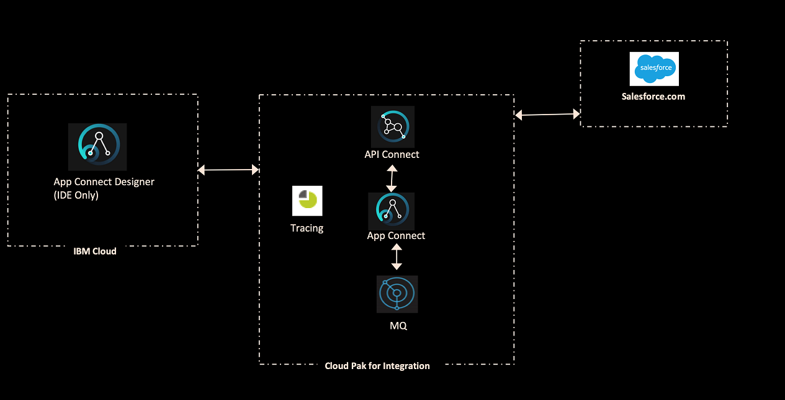

# FastStart 2020 API Connect Lab
===============

In this lab you will work with one of the more common API Use cases that involve the exposure of enterprise systems that are both located on premesis as well as in the Cloud.

### The Use Case

You have been tasked with exposing an API that provide access to business systems for other parties to embed in their applications.  This interface will allow for third parties to submit invoice information via RESTful API that will be passed along to back end ERP systems via a Message Queueing (MQ) interface.  

The API itself will need to be a composite interface that is based on two smaller microservice-like interfaces.

interface #1: Customer API that extracts information from CRM system (Salesforce)

interface #2: API that consumes data to be processed on to a queue to be loaded into the ERP system.

An architecture diagram of what this will look like is provided here

### Requirements

How you build this interface for the most part, will be up to you.  There are a few hard requirements that need to be followed:

1. You must use the Cloud Pak for Integration for the use case
2. For Interface #1 you will use the App Connect Designer
3. Interface #2 will be created using ACE Toolkit.  It has been provided for you as a convenience
4. You will use API Connect to create a composite API for Interfaces 1 and 2.  
5. The end state API will be able to accept JSON coming in, extract the Customer (aka Account) information from Salesforce and then write the incoming JSON to Queue
6. The composite API will be secured by requiring both an Application Client ID and Secret to be passed to it

### Before you start

You are going to need a few things before you get started.

* If you don't have one already - get a free developer account at Salesforce.com at this link [here](www.sforce.com)
* Once you get access to your Salesforce environment, you will need to set up an app such that the local connector on CP4I can connect to Salesforce.  Use this as your [guide](https://www.ibm.com/support/knowledgecenter/SSTTDS_11.0.0/com.ibm.etools.mft.doc/bz90640_.html).

### Main Tasks to be executed

Once you have completed the items in the previous `Before you Start` section.  You can proceed with the steps below

1. Create your App Connect Designer Flow that will be exposed a REST API.  It needs to connect to your Salesforce instance and return a few key fields from the Account record.  Pick the main ones (Account Name, BillingAddress etc) and have it return it an array of JSON objects representing multiple accounts.  No filter is required, and limit the output to only return the first 10 records from Salesforce.  Once it is complete, test it to make sure it returns output expected.  
2. Export the API as a `.bar` from the IBM Cloud.  Save it locally where you can easily load it into the Cloud Pak for Integration Later.
2. Deploy the Designer Flow on to the Cloud Pak for Integration.  You will deploy this as its own helm release.  Use this documentation as your [guide](https://www.ibm.com/support/knowledgecenter/en/SSTTDS_11.0.0/com.ibm.ace.icp.doc/run-designerflow-in-acesoftware/creatingiserver4baricp4i.html).  You can link it to tracing if you like
3. Deploy the `Invoice.bar` (link when ready) file to your CP4I instance.  Deploy it using ACE with the MQ Client.  You can link it to tracing if you like
4. Test the Invoice interface by passing the sample data (link when ready) into the interface using the ARC or some REST test interface.
5. Create a single API in API Connect that references both Interface 1 and 2.  Test the API using the APIC Interface and then add the Client ID + Secret security schema and redploy your product.